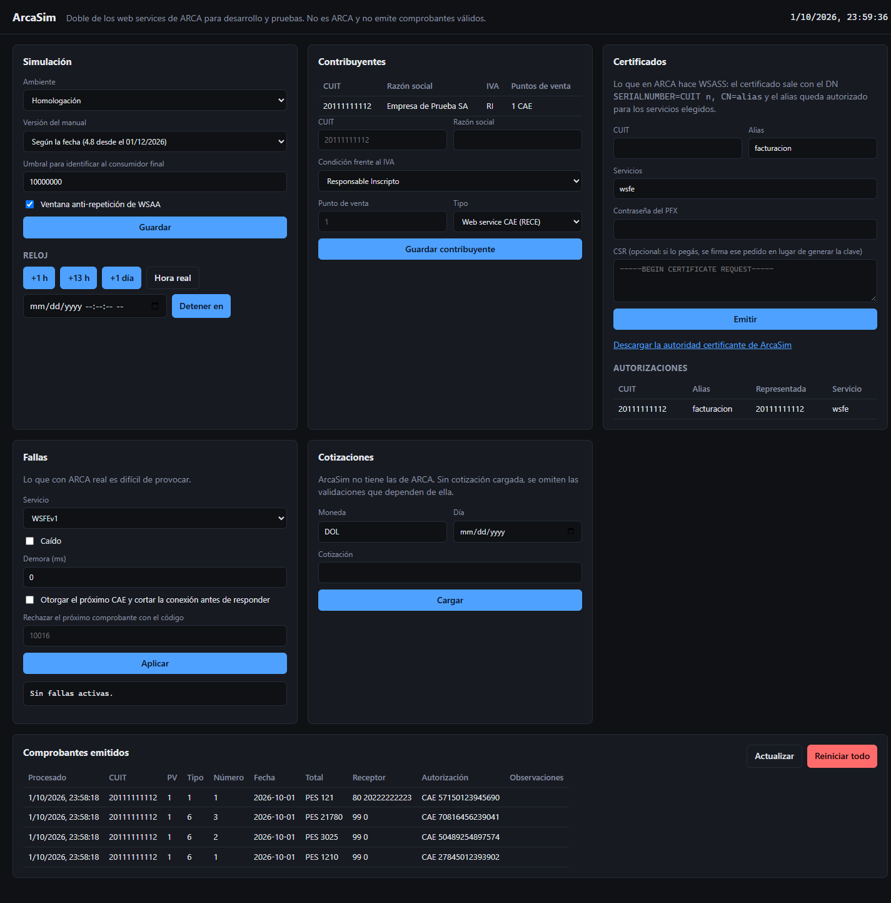
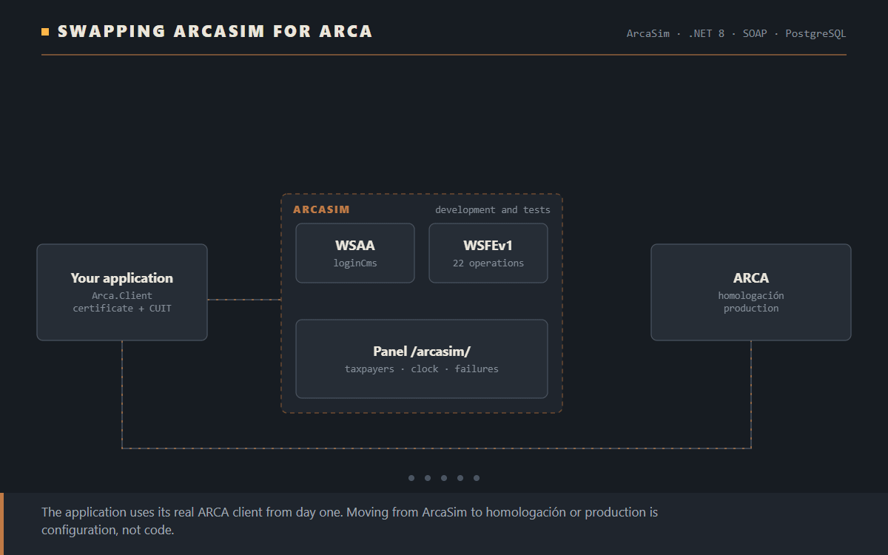
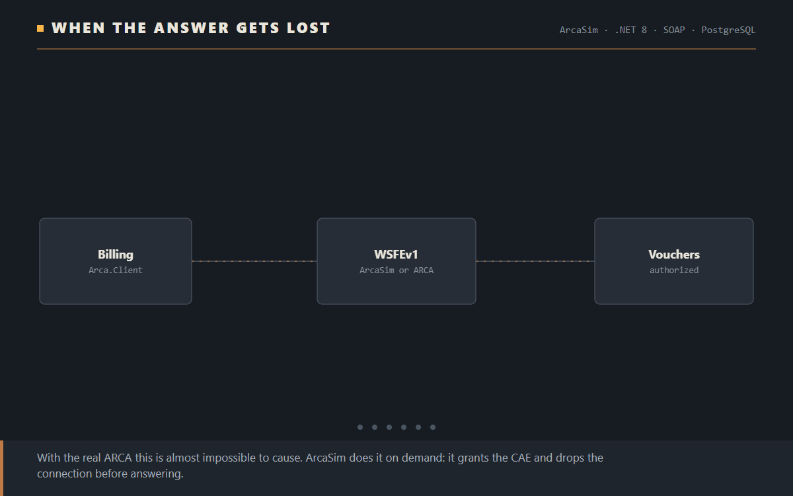

# ArcaSim

**ARCA's web services, for developing and testing without ARCA.** ARCA is Argentina's tax authority, and every electronic invoice needs its authorization code (CAE). An application that invoices points its real ARCA client (WSAA for the access ticket, WSFEv1 for the CAE) at ArcaSim during development, in its tests and in demos. Going to production means changing two addresses and the certificate in the configuration, not the code.

ArcaSim speaks ARCA's protocol: the same WSDL files, the same operations, the same errors with their real texts. A client generated from the official WSDL works against ArcaSim untouched.

**[Versión en español](README.md)**

> ArcaSim is not related to ARCA. The CAEs it grants have no tax validity and its access tickets only work against ArcaSim.



## What it does

| | |
|---|---|
| **WSAA** | The whole `loginCms`: checks the signed CMS and the access request in ARCA's order, hands out the ticket in its exact format with a 12-hour life, and answers with the same faults, including the window that refuses a new ticket while the previous one is still valid. |
| **WSFEv1** | All 22 operations: CAE for one voucher or a batch, the last number authorized, looking up an issued voucher, the parameter tables and the CAEA contingency regime. The manual's validations answer with the code and the text ARCA answers with. |
| **Fictitious taxpayers** | Issuers with their VAT condition and points of sale, and receivers. What WSASS does at ARCA, the panel does here: it issues the certificate with the DN ARCA requires and authorizes the service. |
| **Failures on demand** | What is hard to cause against the real ARCA: the service down, a delay, rejecting the next voucher with a chosen code, or granting the CAE and dropping the connection before answering, to test recovery. |
| **Its own clock** | Freeze it or move it ahead: expire a ticket, leave a voucher's date range or cross 01/12/2026, when the receiver's VAT condition becomes mandatory. |



## Using it from an application

The repository ships **`Arca.Client`**, the WSAA and WSFEv1 client applications use. It knows nothing about ArcaSim: it signs the request with the certificate, keeps the ticket until it expires, builds the vouchers and tells a rejection (fix it and send it again) from a failure worth retrying.

```csharp
var options = new ArcaOptions
{
    WsaaUrl = new Uri("https://localhost:7443/ws/services/LoginCms"),
    WsfeUrl = new Uri("https://localhost:7443/wsfev1/service.asmx"),
    Certificate = ArcaOptions.LoadCertificate("certs/arcasim-20111111112.pfx", "password"),
    Cuit = 20111111112,
    TicketCacheDirectory = "data/tickets",
};
var wsfe = new WsfeClient(http, new WsaaClient(http, options), options);

var result = await wsfe.AuthorizeNextAsync(pointOfSale: 1, voucherType: 6, new Voucher
{
    Concept = 1, DocumentType = 99, DocumentNumber = 0,
    Total = 1210, Net = 1000, Vat = 210, ReceiverVatCondition = 5,
    VatLines = [new VatLine(5, 1000, 210)],
});
// result.Approved, result.Cae, result.CaeDue, result.Observations, result.Errors
```

To move to homologación (ARCA's test environment) or production, `WsaaUrl`, `WsfeUrl` and the certificate change to the one WSASS issues:

| | WSAA | WSFEv1 |
|---|---|---|
| ArcaSim | `https://<host>/ws/services/LoginCms` | `https://<host>/wsfev1/service.asmx` |
| Homologación | `https://wsaahomo.afip.gov.ar/ws/services/LoginCms` | `https://wswhomo.afip.gov.ar/wsfev1/service.asmx` |
| Production | `https://wsaa.afip.gov.ar/ws/services/LoginCms` | `https://servicios1.afip.gov.ar/wsfev1/service.asmx` |



If the answer to a CAE request gets lost, `AuthorizeNextAsync` asks `FECompConsultar` whether the number was authorized before failing, which is ARCA's own procedure: a blind resend would get "number out of sequence".

## For engineers

### What "the same as ARCA" means

| Level | What matches | How it is checked |
|---|---|---|
| Contract | Paths, ARCA's WSDL files (with ArcaSim's address), operations, namespaces, SOAP 1.1 and 1.2 | A client `dotnet-svcutil` generates from ARCA's WSDL asks ArcaSim for a CAE, over SOAP 1.1 and 1.2 |
| Bytes | WSFEv1 answers in one line with the `FEHeaderInfo` header, an empty `<CAE />`, amounts without trailing zeros, the literal `NULL` for empty dates; WSAA answers with Axis faults and HTTP 500 | Tests that compare ArcaSim's answers with real ARCA responses: an approved CAE with an observation, a rejected resend and a lookup match byte for byte except the CAE number |
| Errors | The manual's codes, and the real texts where they are known, missing accents and double spaces included | [Coverage of the 495 codes](docs/cobertura.md), generated from the code |
| Behavior | Numbering per CUIT, point of sale and type; no idempotency; a batch stops at the first rejection; 12-hour ticket; anti-replay window | Scenario tests |

### Architecture

```
src/
  ArcaSim.Domain           taxpayers, points of sale, aliases and authorizations, environments
  ArcaSim.Application      WSAA, WSFEv1 (22 operations), validations as rules with a code per method
    Wsfe/Data/             the manual's 495 codes and the parameter tables, extracted from the study
  ArcaSim.Infrastructure   in-memory and PostgreSQL storage, ArcaSim's own certification authority
  ArcaSim.Api              the SOAP layer (ASMX dialect for WSFEv1, Axis for WSAA), the API and the /arcasim/ panel
  Arca.Client              the client applications use
tests/ArcaSim.Tests        64 tests: scenarios, bytes against real responses, the WSDL client, both stores
```

- **Its own SOAP layer instead of CoreWCF.** ARCA has three different dialects (.NET ASMX in WSFEv1, Apache Axis in WSAA, Java in the taxpayer registry) with their quirks, and a generic framework would smooth them out. WSFEv1 reads and writes through `XmlSerializer`, the serializer ASMX itself uses: it accepts elements in any order, ignores unknown ones and those without the namespace, and answers in the same format.
- **Rules as data.** Each validation is a rule carrying its code in `FECAESolicitar` and its code in `FECAEARegInformativo` (where many observe instead of rejecting). Whether it rejects or observes, and its text, come from the manual's table.
- **Profiles.** Environment (homologación or production: header texts, anti-replay window of 10 or 2 minutes) and manual version (4.7 or 4.8), which by default follows ArcaSim's clock.
- **Persistent keys.** The certification authority and the ticket-signing key live in the data directory: an application keeps its ticket for 12 hours and should not lose it because ArcaSim restarted.

The full study of ARCA's API is in [`docs/arca/`](docs/arca/) (in Spanish): [WSAA](docs/arca/wsaa.md), [WSFEv1](docs/arca/wsfev1.md), [its codes](docs/arca/wsfev1-codigos.md), the [service catalog](docs/arca/catalogo.md) and the [regulations](docs/arca/normativa.md). The design is in [docs/diseno.md](docs/diseno.md).

### Running it

```bash
# In memory, for development (panel at http://localhost:5199/arcasim/)
dotnet run --project src/ArcaSim.Api --urls "http://localhost:5199;https://localhost:7443"

# With PostgreSQL, for a team or a CI (panel at http://localhost:7080/arcasim/)
docker compose up -d

dotnet test
```

Configuration (`appsettings.json` or environment variables):

| Key | Values | |
|---|---|---|
| `ArcaSim:Storage` | `Memory` (default), `Postgres` | With `Postgres`, the connection string goes in `ConnectionStrings:ArcaSim` |
| `ArcaSim:Environment` | `Homologacion` (default), `Produccion` | |
| `ArcaSim:DataDirectory` | path | Where the certification authority and the ticket key are kept |
| `ArcaSim:ReplayWindowEnabled` | `true` (default), `false` | WSAA's anti-replay window |

Clients generated from the official WSDL expect HTTPS, because ARCA's addresses are HTTPS: ArcaSim has to listen on HTTPS and the client has to trust its development certificate.

### Admin API

Everything in the panel is under `/arcasim/api`: `PUT /taxpayers/{cuit}`, `POST /certificates` (with a CSR it returns the certificate; without one, a PFX with the key), `GET /authorizations`, `PUT /chaos/{service}`, `POST /clock` (`freezeAt`, `advanceMinutes`), `GET /vouchers`, `PUT /rates`, `PUT /settings` and `POST /reset`.
