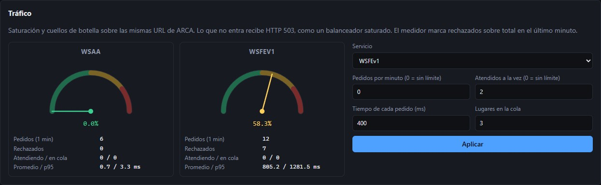
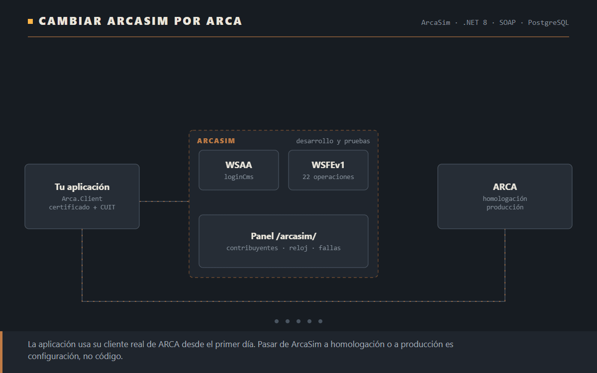
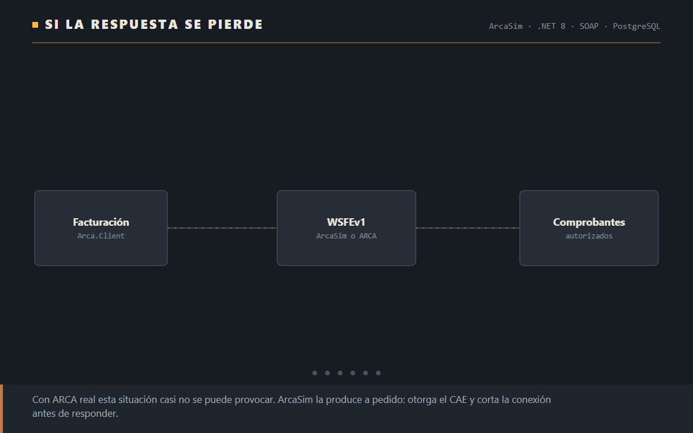

# ArcaSim

**Los web services de ARCA, para desarrollar y probar sin ARCA.** Una aplicación que factura usa su cliente real de ARCA (WSAA para el ticket de acceso, WSFEv1 para los CAE) apuntado a ArcaSim mientras se desarrolla, en los tests y en las demos. Cuando sale a producción se cambian dos direcciones y el certificado en la configuración, no el código.

ArcaSim habla el mismo protocolo que ARCA: los mismos WSDL, las mismas operaciones, los mismos errores con sus textos reales. Un cliente generado del WSDL oficial funciona contra ArcaSim sin tocarlo.

**[Referencia de la API](docs/api.md)** · **[English version](README.en.md)**

> ArcaSim no tiene relación con ARCA. Los CAE que otorga no tienen validez fiscal y sus tickets de acceso solo sirven contra ArcaSim.


## Qué hace

| | |
|---|---|
| **WSAA** | `loginCms` completo: valida el CMS firmado y el pedido de acceso en el orden en que lo hace ARCA, entrega el ticket con el formato exacto y la vida de 12 horas, y responde con los mismos faults, incluida la ventana que impide pedir otro ticket mientras el anterior sigue vigente. |
| **WSFEv1** | Las 22 operaciones: pedir CAE de a uno o en lotes, el último número autorizado, consultar un comprobante emitido, las tablas de parámetros y el régimen de contingencia CAEA. Las validaciones del manual devuelven el código y el texto que devuelve ARCA. |
| **Solo endpoints** | Arranca con acceso abierto: cualquier certificado con el CUIT en el DN entra (el de WSASS o uno autofirmado), y el contribuyente y el punto de venta se crean la primera vez que se usan. No hace falta cargar nada antes. |
| **Contribuyentes ficticios** | Emisores con su condición frente al IVA y sus puntos de venta, y receptores. Lo que en ARCA hace WSASS lo hace el panel: emite el certificado con el DN que pide ARCA y autoriza el servicio. |
| **Fallas a pedido** | Lo que con ARCA real es difícil de provocar: el servicio caído, una demora, rechazar el próximo comprobante con un código dado, u otorgar el CAE y cortar la conexión antes de responder, para probar la recuperación. |
| **Saturación y cuellos de botella** | Límite de pedidos por minuto, capacidad con tiempo de atención y una cola: lo que no entra recibe HTTP 503, como un balanceador saturado. El panel muestra el medidor de saturación de cada servicio y un registro en vivo. |
| **Reloj propio** | Detenerlo o adelantarlo: vencer un ticket, salir del rango de fechas de un comprobante o cruzar el 01/12/2026, cuando la condición frente al IVA del receptor pasa a ser obligatoria. |





## Cómo se usa desde una aplicación

Desde cualquier lenguaje, con el cliente de ARCA que ya tenga la aplicación: se cambian las dos URL y el certificado, y nada más. El recorrido completo, con los ejemplos de cada operación, está en la [referencia de la API](docs/api.md).

Para .NET, el repositorio trae **`Arca.Client`**, el cliente de WSAA y WSFEv1 que usan las aplicaciones. No sabe nada de ArcaSim: firma el pedido con el certificado, guarda el ticket hasta que vence, arma los comprobantes y distingue un rechazo (se corrige y se reenvía) de una falla que conviene reintentar.

```csharp
var options = new ArcaOptions
{
    WsaaUrl = new Uri("https://localhost:7443/ws/services/LoginCms"),
    WsfeUrl = new Uri("https://localhost:7443/wsfev1/service.asmx"),
    Certificate = ArcaOptions.LoadCertificate("certs/arcasim-20111111112.pfx", "clave"),
    Cuit = 20111111112,
    TicketCacheDirectory = "data/tickets",
};
var wsfe = new WsfeClient(http, new WsaaClient(http, options), options);

var result = await wsfe.AuthorizeNextAsync(pointOfSale: 1, voucherType: 6, new Voucher
{
    Concept = 1, DocumentType = 99, DocumentNumber = 0,
    Total = 1210, Net = 1000, Vat = 210, ReceiverVatCondition = 5,
    VatLines = [new VatLine(5, 1000, 210)],
});
// result.Approved, result.Cae, result.CaeDue, result.Observations, result.Errors
```

Para pasar a homologación o a producción se cambian `WsaaUrl`, `WsfeUrl` y el certificado por el que emite WSASS:

| | WSAA | WSFEv1 |
|---|---|---|
| ArcaSim | `https://<host>/ws/services/LoginCms` | `https://<host>/wsfev1/service.asmx` |
| Homologación | `https://wsaahomo.afip.gov.ar/ws/services/LoginCms` | `https://wswhomo.afip.gov.ar/wsfev1/service.asmx` |
| Producción | `https://wsaa.afip.gov.ar/ws/services/LoginCms` | `https://servicios1.afip.gov.ar/wsfev1/service.asmx` |



Si la respuesta a un pedido de CAE se pierde, `AuthorizeNextAsync` consulta con `FECompConsultar` si el número quedó autorizado antes de dar el error, que es el procedimiento que indica ARCA: reenviar a ciegas devolvería «número no correlativo».

## Para técnicos

### Qué significa «igual que ARCA»

| Nivel | Qué coincide | Cómo se verifica |
|---|---|---|
| Contrato | Rutas, WSDL oficiales (con la dirección de ArcaSim), operaciones, namespaces, SOAP 1.1 y 1.2 | Un cliente generado con `dotnet-svcutil` del WSDL de ARCA pide un CAE contra ArcaSim, en SOAP 1.1 y 1.2 |
| Bytes | WSFEv1 responde en una línea con el encabezado `FEHeaderInfo`, `<CAE />` vacío, importes sin ceros de relleno, el literal `NULL` en fechas vacías; WSAA responde con los faults de Axis y HTTP 500 | Tests que comparan la respuesta de ArcaSim con respuestas reales de ARCA: un CAE aprobado con observación y un reenvío rechazado coinciden byte a byte salvo el número de CAE |
| Errores | Códigos del manual y los textos reales donde se conocen, con sus faltas de tildes y dobles espacios | [Cobertura de los 495 códigos](docs/cobertura.md), generada del código |
| Comportamiento | Numeración correlativa por CUIT, punto de venta y tipo; sin idempotencia; un lote se corta en el primer rechazo; ticket de 12 h; ventana anti-repetición | Tests de escenarios |

### Arquitectura

```
src/
  ArcaSim.Domain           contribuyentes, puntos de venta, alias y autorizaciones, ambientes
  ArcaSim.Application      WSAA, WSFEv1 (22 operaciones), validaciones como reglas con su código por método
    Wsfe/Data/             los 495 códigos del manual y las tablas de parámetros, extraídos del estudio
  ArcaSim.Infrastructure   almacenamiento en memoria y en PostgreSQL, la autoridad certificante propia
  ArcaSim.Api              la capa SOAP (dialecto ASMX para WSFEv1, Axis para WSAA), la API y el panel /arcasim/
  Arca.Client              el cliente que usan las aplicaciones
tests/ArcaSim.Tests        72 tests: escenarios, bytes contra respuestas reales, cliente del WSDL, los dos almacenamientos
```

- **Capa SOAP propia en lugar de CoreWCF.** ARCA tiene tres dialectos distintos (ASMX de .NET en WSFEv1, Apache Axis en WSAA, Java en el padrón) con sus rarezas, y un framework genérico las normaliza. WSFEv1 lee y escribe con `XmlSerializer`, el mismo serializador que usa ASMX: acepta los elementos en cualquier orden, ignora los desconocidos y los que vienen sin namespace, y responde con el mismo formato.
- **Reglas como datos.** Cada validación es una regla con el código que lleva en `FECAESolicitar` y el que lleva en `FECAEARegInformativo` (donde muchas observan en lugar de rechazar). Si rechaza u observa, y el texto, salen de la tabla del manual.
- **Perfiles.** Ambiente (homologación o producción: textos del encabezado, ventana anti-repetición de 10 o 2 minutos) y versión del manual (4.7 o 4.8), que por defecto sigue la fecha del reloj de ArcaSim.
- **Un bus de eventos entre las partes.** El control de tráfico, WSAA y WSFEv1 publican lo que pasa (pedido atendido o rechazado, ticket emitido, comprobante autorizado o rechazado); el medidor y el registro en vivo solo escuchan. La API de administración son controllers MVC, uno por recurso; los endpoints de ARCA van por la capa SOAP, que escribe los bytes exactos.
- **Claves persistentes.** La autoridad certificante y la clave que firma los tickets se guardan en el directorio de datos: una aplicación guarda su ticket 12 horas y no tiene que perderlo porque ArcaSim se reinició.

El estudio completo de la API de ARCA está en [`docs/arca/`](docs/arca/): [WSAA](docs/arca/wsaa.md), [WSFEv1](docs/arca/wsfev1.md), [sus códigos](docs/arca/wsfev1-codigos.md), el [catálogo de servicios](docs/arca/catalogo.md) y la [normativa](docs/arca/normativa.md). El diseño, en [docs/diseno.md](docs/diseno.md).

### Correrlo

```bash
# La imagen publicada, en memoria (panel en http://localhost:7080/arcasim/)
docker run -d -p 7080:8080 -v arcasim-data:/data ghcr.io/federicomoroz/arcasim

# Desde el código, en memoria (panel en http://localhost:5199/arcasim/)
dotnet run --project src/ArcaSim.Api --urls "http://localhost:5199;https://localhost:7443"

# Con PostgreSQL, para un equipo o una CI (panel en http://localhost:7080/arcasim/)
docker compose up -d

dotnet test
```

Configuración (`appsettings.json` o variables de entorno):

| Clave | Valores | |
|---|---|---|
| `ArcaSim:Access` | `Open` (por defecto), `Strict` | `Strict` pide lo que pide ARCA: certificado de la autoridad de ArcaSim, autorización y contribuyente registrado |
| `ArcaSim:Storage` | `Memory` (por defecto), `Postgres` | Con `Postgres`, la cadena va en `ConnectionStrings:ArcaSim` |
| `ArcaSim:Environment` | `Homologacion` (por defecto), `Produccion` | |
| `ArcaSim:DataDirectory` | ruta | Donde quedan la autoridad certificante y la clave de los tickets |
| `ArcaSim:ReplayWindowEnabled` | `true` (por defecto), `false` | La ventana anti-repetición de WSAA |

Los clientes generados del WSDL oficial esperan HTTPS, porque las direcciones de ARCA lo son: ArcaSim tiene que escuchar en HTTPS y el cliente, confiar en su certificado de desarrollo.

### API de administración y referencia completa

Las 22 operaciones, los errores, la API de administración, los escenarios de prueba y cómo integrarlo desde cualquier lenguaje están en la **[referencia de la API](docs/api.md)**. [`docs/ejemplos/curl.sh`](docs/ejemplos/curl.sh) pide un CAE con openssl y curl, sin ninguna librería.

## Licencia

[MIT](LICENSE): se puede usar, modificar y distribuir libremente, también en proyectos comerciales.
